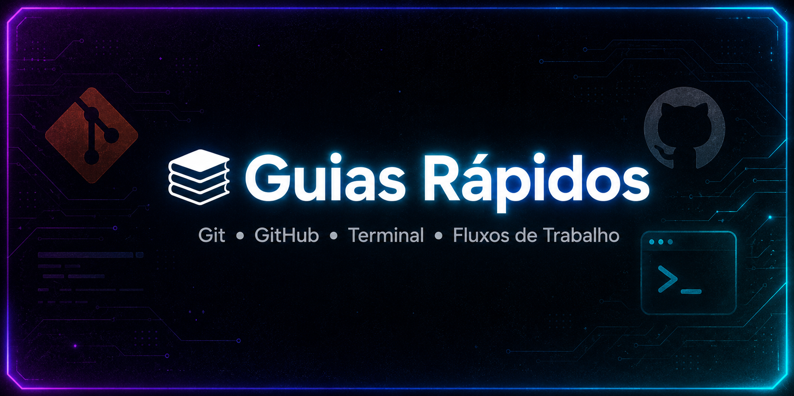

  

<h1 style="font-size: 3rem; font-weight: 800;">📚 Guias Rápidos</h1> <h3 style="margin-top: -10px;">Git • GitHub • Terminal • Fluxos de Trabalho</h3>

 

<!-- Badges -->     

  

 Coleção de guias curtos, diretos e progressivos para dominar Git, GitHub e linha de comando. Criados com foco em clareza, exemplos reais e saídas comentadas. 

## 🎨 Visão Geral

Este repositório reúne materiais pensados para estudo rápido e eficiente:

- 🖥️ Comandos de Terminal
- 🐙 Git (básico e avançado)
- ☁️ GitHub e colaboração
- 🔧 Fluxos de trabalho reais

Cada guia é independente, mas juntos formam uma trilha completa.

## 📘 Sumário dos Guias

### 🖥️ Guia de Comandos de Terminal

Fundamentos essenciais para navegar no sistema, manipular arquivos, entender POSIX e dominar o shell.

### 📘 Guia 1 — Git Básico + Configurações

“Git funciona registrando snapshots (fotos) do estado do projeto a cada commit.”

Conteúdo:

- O que é Git e como funciona internamente
- `git init`, `.git` e estrutura interna
- Configurações (system, global, local)
- `git status`, `git add`, `git commit`
- .gitignore` e boas práticas
- Histórico com git log
- Fluxo básico de versionamento

---

### 📙 Guia 2 — Staging Area e Commits Avançados

“A staging area é uma área intermediária entre os arquivos do seu projeto e o commit que você vai criar.”

Conteúdo:

- Estados dos arquivos no Git
- `git add -p` (adição interativa)
- Diferença entre working directory, staging e commit
- `git commit --amend`
- Commits com título + descrição
- Commits vazios
- `git diff` e `git diff --staged`
- Reverter e resetar commits com segurança

---

### 📕 Guia 3 — (em desenvolvimento)

Baseado no arquivo do repositório.Pode incluir: branches, merges, GitHub remoto, pull requests, workflows etc.

---

### 🔗 Como os guias se conectam

Terminal → base para qualquer trabalho com Git

Guia 1 → fundamentos absolutos do Git

Guia 2 → práticas profissionais e domínio da staging area

Guia 3 → GitHub, branches e colaboração

📂 Estrutura do Repositório

guias_rapidos/  
 ├── guias_em_pdf/  
 ├── guia_comandos.md  
 ├── guia_git_e_github01.md  
 ├── guia_git_e_github02.md  
 ├── guia_git_e_github03.md  
 └── README.md

👤 Autor

Anderson de Matos Guimarães

📧 anderson.m.guimaraes@icloud.com  
🆔 ORCID: 0009-0009-5107-5137  
🐙 GitHub: PadawanXXVI

📄 Licença

Este repositório está licenciado sob MIT License.
